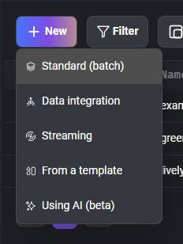
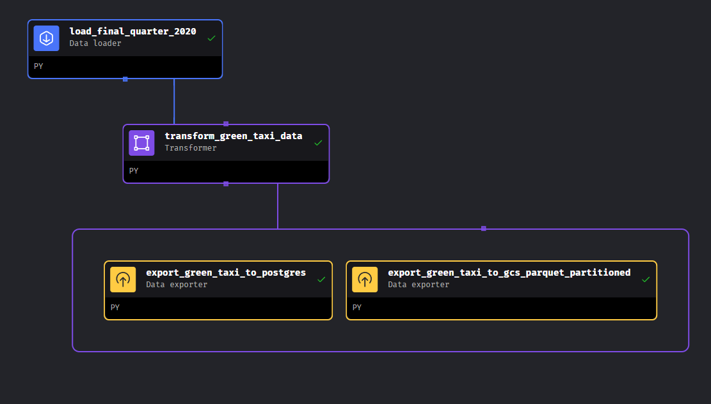
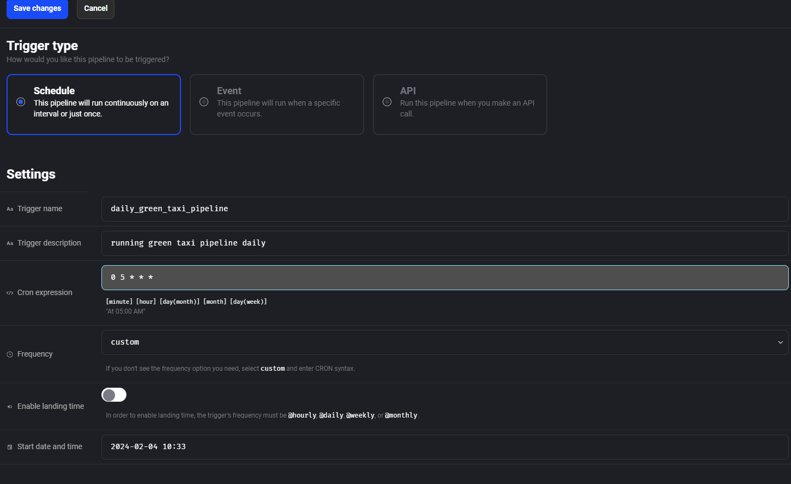
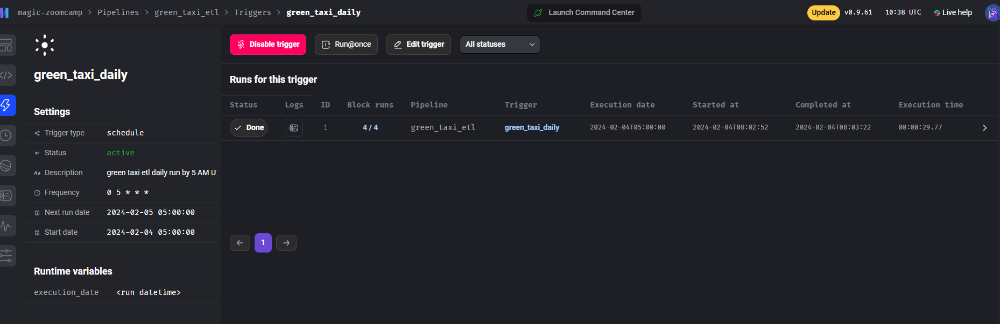
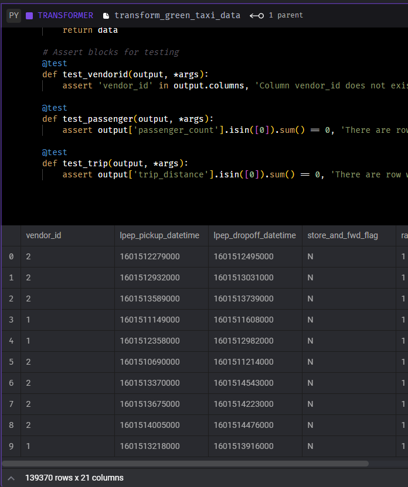
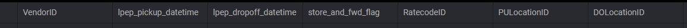
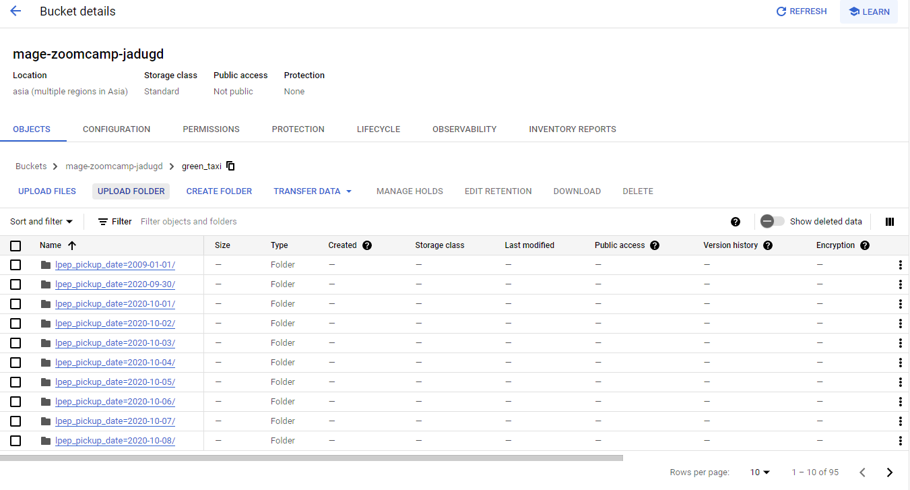

## Week 2 Homework Solution

This is the answer from Homework question in homework.md

## Setup the Mage

clone from official mage repository
```bash
git clone https://github.com/mage-ai/mage-zoomcamp.git
```
change directory to the folder and build the image 

```bash
docker compose build
```

then run the image in detached mode :

```bash
docker compose up -d
```

Finally open the Mage UI from :
```bash
http://localhost:6789/
```

## Making the Pipeline

Go to pipeline, and create standard batch pipeline.




Edit Pipeline. Go to `edit > pipeline setting` to rename the pipeline. Save changes and start writing the pipeline. 

My pipeline was like this :



Here is the code for each block :

- Data Loader : 
    - [load_final_quarter_2020](https://github.com/jadugd/Jadug_ZoomCamp2024/blob/main/homework/module_2/solution/magic-zoomcamp/data_loaders/load_final_quarter_2020.py)

- Transformer :
    - [transform_green_taxi_data](https://github.com/jadugd/Jadug_ZoomCamp2024/blob/main/homework/module_2/solution/magic-zoomcamp/transformers/transform_green_taxi_data.py)

- Data Exporter :
    - [export_green_taxi_to_postgres](https://github.com/jadugd/Jadug_ZoomCamp2024/blob/main/homework/module_2/solution/magic-zoomcamp/data_exporters/export_green_taxi_to_postgres.py)

    - [export_green_taxi_to_gcs_parquet_partitioned](https://github.com/jadugd/Jadug_ZoomCamp2024/blob/main/homework/module_2/solution/magic-zoomcamp/data_exporters/export_green_taxi_to_gcs_parquet_partitioned.py)


## Scheduling the pipeline
In the pipeline menu, go to Triggers and create a new trigger.



Choose schedule type trigger. Fill the needed information. When on Frequency i choose custom so i can typed the time exactly. The Cron expression to running daily at 5:00 AM was like this `0 5 * * *`. Finally save the changes. And enable trigger.



### Answering the Questions

## Question 1. Data Loading

Once the dataset is loaded, what's the shape of the data?

Run the data_loader : `load_final_quarter_2020`

in my case the output was like this :


So i pick the option `266,855 rows x 20 columns`

## Question 2. Data Transformation

Upon filtering the dataset where the passenger count is greater than 0 _and_ the trip distance is greater than zero, how many rows are left?

The transformer block : `transform_green_taxi_data` already filtered out `passenger_count` column and `trip_count` column that had value greater than zero. So you can just see the output anyway.



i pick `139,370 rows` in my case.


## Question 3. Data Transformation

Which of the following creates a new column `lpep_pickup_date` by converting `lpep_pickup_datetime` to a date?

I'm following the code from previous section so my answer is : `data['lpep_pickup_date'] = data['lpep_pickup_datetime'].dt.date`

## Question 4. Data Transformation

What are the existing values of `VendorID` in the dataset?

if you see the result of `df['vendor_id'].unique()` which equal to query `SELECT DISTINCT vendor_id` The value is `1 or 2`.

## Question 5. Data Transformation

How many columns need to be renamed to snake case?

Let's see when we load the data, because i already transformed all the column name using regex functions.

I belived the column that in camel case before was `VendorID` `RatecodeID` `PULocationID` and `DOLocationID`
so it was `4` columns.



## Question 6. Data Exporting

Once exported, how many partitions (folders) are present in Google Cloud?

In my case the partitioned folder by day at columns `lpep_pickup_date` was 95 in my cloud storage so i'll pick the closest answer which is `96`



## Closing
I learned a lot of new things in this module from mage as the great orchestration tool, some pandas dataframe function and some of gcp feature. Thanks for reading ✨