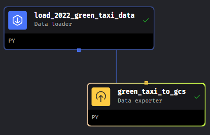
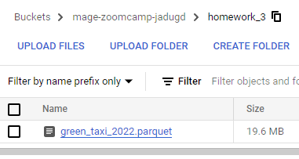

# Homework 3 Solution

[Homework link ](https://github.com/DataTalksClub/data-engineering-zoomcamp/blob/main/cohorts/2024/03-data-warehouse/homework.md)


## Data Loading
In this case i used Mage to download the Green Taxi Data from [Here](https://www.nyc.gov/site/tlc/about/tlc-trip-record-data.page). The Data used is 2022 Green Taxi from January to December.

My Pipeline look like below.



And the result.



The code for the pipeline is [here](https://github.com/jadugd/Jadug_ZoomCamp2024/tree/main/homework/module_3/mage_files)

## Creating External Table
Our external table source will be using the parquet file of Green Taxi on 2022 from Parquet file in Google Cloud Storage Bucket. 
Here's Query to create external table from file on BigQuery.

```sql
CREATE OR REPLACE EXTERNAL TABLE `zoomcamp2024-411908.homework_3.external_green_taxi_2022`
OPTIONS (
  format = 'parquet',
  uris = ['gs://mage-zoomcamp-jadugd/homework_3/green_taxi_2022.parquet']
);
```

## Creating Materialized Table from External Table
Materialized Table i've created using all columns from external table and Transform the column `lpep_pickup_datetime` and `lpep_dropoff_datetime` to timestamp.

```sql
CREATE OR REPLACE TABLE `zoomcamp2024-411908.homework_3.materialized_green_taxi_2022`
AS
SELECT VendorID, TIMESTAMP_MICROS(CAST(lpep_pickup_datetime/1000 AS INT)) AS lpep_pickup_datetime, 
TIMESTAMP_MICROS(CAST(lpep_dropoff_datetime/1000 AS INT)) AS lpep_dropoff_datetime, store_and_fwd_flag, RatecodeID, PULocationID, DOLocationID, passenger_count, trip_distance, fare_amount, extra, mta_tax, tip_amount, tolls_amount, ehail_fee,improvement_surcharge, total_amount, payment_type, trip_type, congestion_surcharge
FROM `zoomcamp2024-411908.homework_3.external_green_taxi_2022`;
```

### Question 1:
Question 1: What is count of records for the 2022 Green Taxi Data?

```sql
SELECT COUNT(*) FROM `zoomcamp2024-411908.homework_3.external_green_taxi_2022`;
```
The Query Result is `840402`

### Question 2:
Write a query to count the distinct number of PULocationIDs for the entire dataset on both the tables.
What is the estimated amount of data that will be read when this query is executed on the External Table and the Table?

External Table Query
```sql
SELECT COUNT(DISTINCT PULocationID) 
FROM `zoomcamp2024-411908.homework_3.external_green_taxi_2022`;
```
The query above Takes `0B` When Processing

Materialized Table Query
```sql
SELECT COUNT(DISTINCT PULocationID) 
FROM `zoomcamp2024-411908.homework_3.materialized_green_taxi_2022`;
```
This query Takes `6.41MB` when run

### Question 3:
How many records have a fare_amount of 0?

```sql
SELECT COUNT(*) 
FROM `zoomcamp2024-411908.homework_3.external_green_taxi_2022`
WHERE fare_amount = 0; 
```
The query result `1622` rows

### Question 4:
What is the best strategy to make an optimized table in Big Query if your query will always order the results by PUlocationID and filter based on lpep_pickup_datetime? (Create a new table with this strategy)

Example Query Before Partitioning and Clustering
```sql
SELECT * 
FROM `zoomcamp2024-411908.homework_3.materialized_green_taxi_2022`
WHERE DATE(lpep_pickup_datetime) BETWEEN '2022-01-01' AND '2022-07-31'
ORDER BY PULocationID;
```
The query above Takes `114.11 MB` When Running.

Let's try to Partition by `lpep_pickup_datetime` and Clustered by `PULocationID`.

```sql
CREATE OR REPLACE TABLE `zoomcamp2024-411908.homework_3.green_taxi_2022_clustering_partitioned`
PARTITION BY DATE(lpep_pickup_datetime)
CLUSTER BY PULocationID AS
SELECT * FROM `zoomcamp2024-411908.homework_3.materialized_green_taxi_2022`;
```
From the query above we've created a new table called `green_taxi_2022_clustering_partitioned` using `lpep_pickup_datetime` column as a `Partition` and `PULocationID` as a `Cluster`.

Let's compare our query cost after using partition and cluster method.
```sql
SELECT * 
FROM `zoomcamp2024-411908.homework_3.green_taxi_2022_clustering_partitioned`
WHERE DATE(lpep_pickup_datetime) BETWEEN '2022-01-01' AND '2022-07-31'
ORDER BY PULocationID;
```
The query above take `67.94MB` When running slightly reduce the cost before using partition and cluster `114.11 MB`.

### Question 5:
Write a query to retrieve the distinct PULocationID between lpep_pickup_datetime 06/01/2022 and 06/30/2022 (inclusive)

Use the materialized table you created earlier in your from clause and note the estimated bytes. Now change the table in the from clause to the partitioned table you created for question 4 and note the estimated bytes processed. What are these values?

Choose the answer which most closely matches.

Query on Materialized Table:

```sql
SELECT DISTINCT PULocationID
FROM `zoomcamp2024-411908.homework_3.materialized_green_taxi_2022`
WHERE DATE(lpep_pickup_datetime) BETWEEN '2022-06-01' AND '2022-06-30';
```
Cost `12.82 MB` When Processing.

Query on Partitioned and Clustered Table:
```sql
SELECT DISTINCT PULocationID
FROM `zoomcamp2024-411908.homework_3.green_taxi_2022_clustering_partitioned`
WHERE DATE(lpep_pickup_datetime) BETWEEN '2022-06-01' AND '2022-06-30';
```
Cost `1.12 MB` When Processing.

### Question 6:
Where is the data stored in the External Table you created?

I Believe The Data will still located on Google Cloud Storage because BigQuery only read the files Metadata.

### Question 7:
It is best practice in Big Query to always cluster your data:

The Answer is depend on the case, if you rarely use The Filter and Join columns, and the dataset is too small, You can't see the improvement of performance. You can try to cluster the Data if you seen higher cost and variety on filtered column.

### Question 8:
Write a SELECT count(*) query FROM the materialized table you created. How many bytes does it estimate will be read? Why?

The Query:
```sql
SELECT COUNT(*)
FROM `zoomcamp2024-411908.homework_3.materialized_green_taxi_2022`;
```

The query above Cost `0B` When running.
Why? According to BQ Pricing Documentation https://cloud.google.com/bigquery/pricing#table when use count syntax it's access metadata of the table so it already cached and doesn't cost anything.
