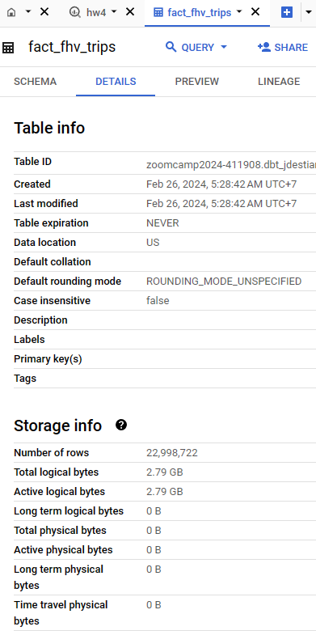

# Homework 4 Solutions

### Data Loading
I use `web_togcs.py` code to ingest fhv trips 2019 to Cloud Storage

and then create the external and materialized table using query in `bigquery_table.sql`

The dbt schema and model for fhv trips are defined in `taxi_rides_dbt` folder

### Question 1: 

**What happens when we execute dbt build --vars '{'is_test_run':'true'}'**
You'll need to have completed the ["Build the first dbt models"](https://www.youtube.com/watch?v=UVI30Vxzd6c) video. 

`It applies a _limit 100_ only to our staging models`

Because the vars are defined in staging models, and if you use the staging model on the core it's derived. But it's only apply to staging model.

### Question 2: 

**What is the code that our CI job will run? Where is this code coming from?**  

`The code from the development branch we are requesting to merge to main`

### Question 3 (2 points)

**What is the count of records in the model fact_fhv_trips after running all dependencies with the test run variable disabled (:false)?**  
Create a staging model for the fhv data, similar to the ones made for yellow and green data. Add an additional filter for keeping only records with pickup time in year 2019.
Do not add a deduplication step. Run this models without limits (is_test_run: false).

Create a core model similar to fact trips, but selecting from stg_fhv_tripdata and joining with dim_zones.
Similar to what we've done in fact_trips, keep only records with known pickup and dropoff locations entries for pickup and dropoff locations. 
Run the dbt model without limits (is_test_run: false).

`22998722`

### Question 4 (2 points)

**What is the service that had the most rides during the month of July 2019 month with the biggest amount of rides after building a tile for the fact_fhv_trips table?**

Create a dashboard with some tiles that you find interesting to explore the data. One tile should show the amount of trips per month, as done in the videos for fact_trips, including the fact_fhv_trips data.

`Yellow`

[Dashboard Link](https://lookerstudio.google.com/s/rI6fOuV7pBk)