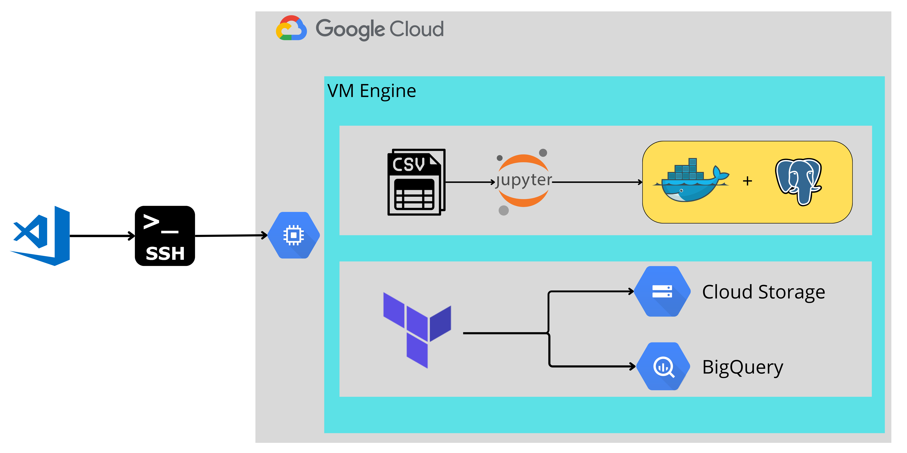

## Module 1 Lerning Review

[Link Post]()

What I learned in the first week is :

- Setup VM on GCP and how to access it on your local machine using SSH Key

- Remote development directly to GCP VM using Visual Studio Code

- Containerization the Postgresql Database using Docker

- Data Ingestion to Database using Jupyter Notebook

- Create a Cloud Storage and BigQuery Dataset using Terraform Code.

